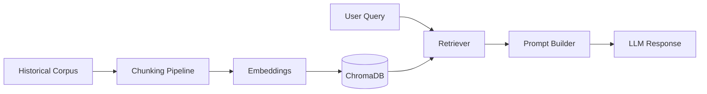
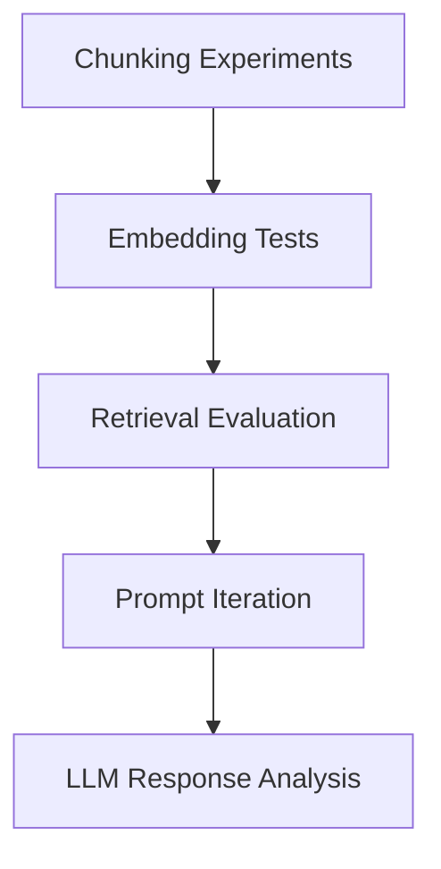

# 🏛️ Sindhu-RAG

<h3 align="center">
Production-Grade RAG Pipeline for Historical Knowledge Systems
</h3>

<p align="center">
  
</p>

---

<p align="center">


</p>

---

# 🌌 What is Sindhu-RAG?

<p align="center">
  
</p>

✨ **Sindhu-RAG** is a visually engineered **Retrieval-Augmented Generation system** designed for:

<div align="center">

| 📚 Historical QA                             | 🧠 Memory-Aware Retrieval  | ⚙️ Prompt Versioning              |
| -------------------------------------------- | -------------------------- | --------------------------------- |
| Semantic search over archaeological datasets | Stateful context injection | Controlled prompt experimentation |

</div>

---

# ⚡ Core Highlights

<div align="center">

| 🧩 Modular Architecture                  | 📈 LLMOps Workflow            | 🔍 Hallucination Reduction  |
| ---------------------------------------- | ----------------------------- | --------------------------- |
| Independent retrieval + prompting layers | Config-driven experimentation | Context-grounded generation |

</div>

---

# 🏗️ Architecture

<p align="center">
  
</p>



---

# 📚 Knowledge Pipeline

<div align="center">

```text
📄 Historical PDFs
        ↓
✂️ Intelligent Chunking
        ↓
🧠 Embedding Generation
        ↓
🗂️ Chroma Vector Storage
        ↓
🔍 Semantic Retrieval
        ↓
🤖 Grounded LLM Response
```

</div>

---

# 🛠️ Tech Stack

<p align="center">

| Layer         | Technology        |
| ------------- | ----------------- |
| 🐍 Language   | Python            |
| 🔗 Framework  | LangChain         |
| 🗂️ Vector DB | ChromaDB          |
| 🎨 Frontend   | Streamlit         |
| 📓 Research   | Jupyter Notebooks |
| ⚙️ Config     | JSON / YAML       |

</p>

---

# 📂 Project Structure

<p align="center">
  
</p>

```bash
SINDHU-RAG/
│
├── 📁 Data/
├── 📁 Notebooks/
├── 📁 prompts/
├── 📁 config/
├── 📁 src/
├── 📁 Storage/
├── 📁 testing/
│
├── requirements.txt
└── README.md
```

---

# 🧠 Engineering Features

<div align="center">

| 🚀 Feature         | ✅ Capability                    |
| ------------------ | ------------------------------- |
| Prompt Versioning  | Reproducible prompt experiments |
| Config Tracking    | Hyperparameter management       |
| Persistent Storage | Vector DB + retrieval caching   |
| Evaluation Logs    | Structured JSON testing         |
| Modular Pipelines  | Easy experimentation            |
| Streamlit UI       | Interactive testing             |

</div>

---

# 📸 UI Preview

<p align="center">


</p>

---

# 🚀 Quick Start

## 📦 Installation

```bash
git clone https://github.com/YS-Pundir/Sindhu-RAG.git

cd sindhu-rag

pip install -r requirements.txt
```

---

## ▶️ Run Application

```bash
streamlit run src/streamlit_app.py
```

---

# 📊 Experiment Workflow



---

# 🎯 Future Roadmap

<div align="center">

| ✅ Planned Features    |
| --------------------- |
| Hybrid Retrieval      |
| LangGraph Integration |
| Multi-Agent RAG       |
| Source Attribution    |
| Docker Deployment     |
| Reranking Pipelines   |

</div>

---

# 🤝 Contributing

```bash
# Fork the repo

git checkout -b feature/new-feature

git commit -m "Added feature"

git push origin feature/new-feature
```

---

# 👤 Author

<div align="center">

## Yuvraj Singh Pundir

🧠 Retrieval-Augmented Generation
⚙️ LLMOps Engineering
🏛️ Historical Knowledge Systems
🚀 Agentic AI Architectures

</div>

---

<p align="center">

⭐ Star the repository if you found it useful!

</p>
